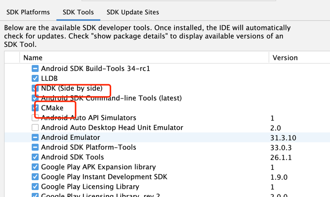

#### 配置NDK环境注意事项
1. 下载NDK和CMake
2. 在local.properties中配置ndk.dir路径：`ndk.dir=/Users/yh/SDK/android-sdk/ndk/25.2.9519653`
3. 在当前工程的build.gradle中配置如下
```shell
android{
  ndkVersion "25.2.9519653"
}
android{
  externalNativeBuild {
        cmake {
            path file('src/main/cpp/CMakeLists.txt')
            version '3.22.1'
        }
    }
}
```

4. 建立cpp和java同级目录，用来放c代码；其他代码就是模板代码
##### 小结
1. 定义本地方法是需要再类中，不能定义为顶层函数。

#### FFmpeg环境配置
1. 在mac中安装ffmpeg环境：`brew install ffmpeg`
2. 在cmake文件中配置如下：
   1. include_directories("~/usr/local/Cellar/ffmpeg/3.3.2/include")
   2. link_directories("~/usr/local/Cellar/ffmpeg/3.3.2/lib")
   3. target_link_libraries中导入如下库
      1. 所有的.a文件
3. 如果你通过brew安装了ffmpeg，你可以用以下命令找到它的路径：`brew info ffmpeg`

      